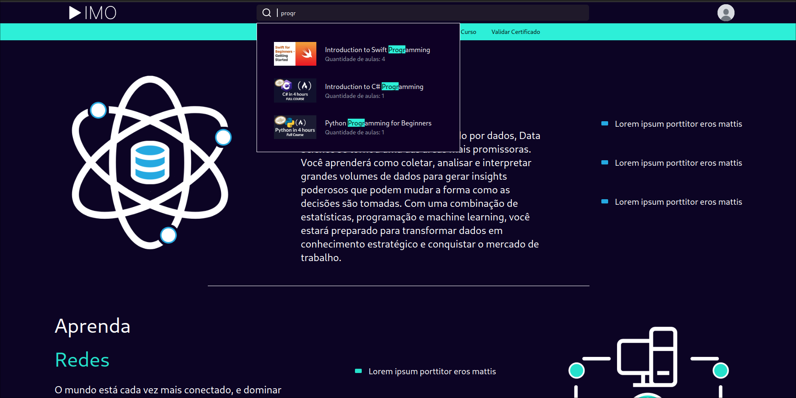
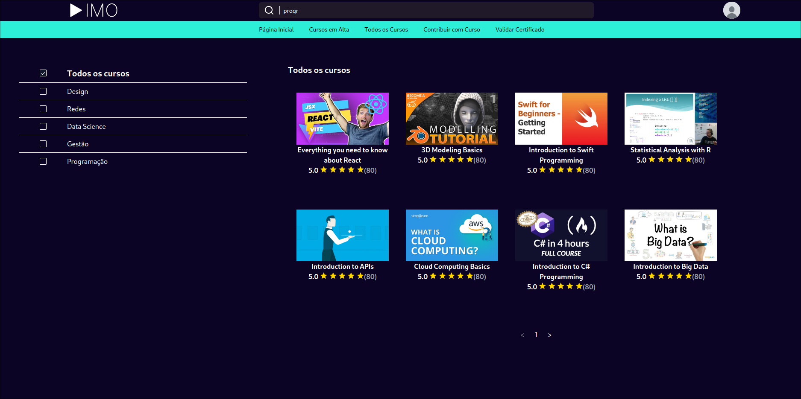
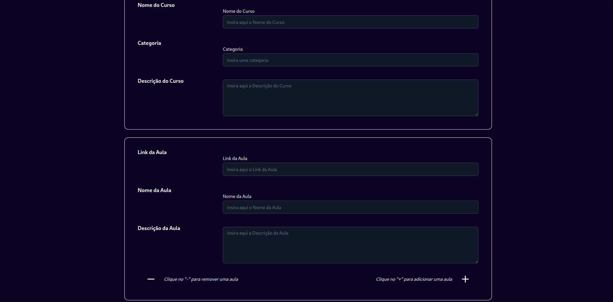
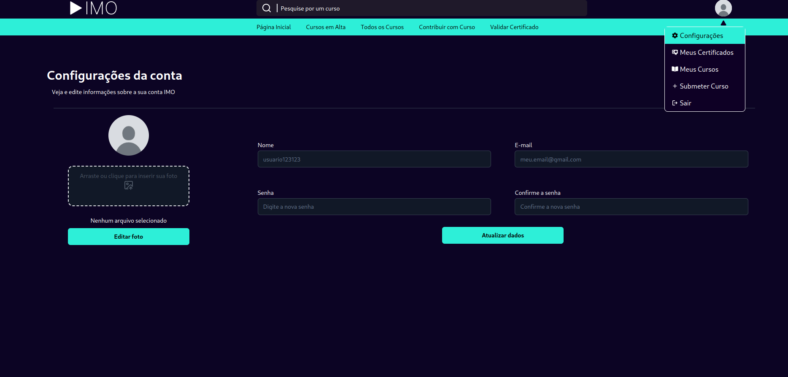
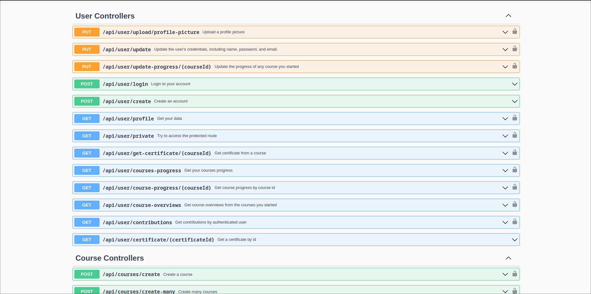

# IMO - Plataforma para cursos de TI
> Integrantes https://github.com/orgs/imofatec/people

## Quem somos
Este projeto está sendo desenvolvido na FATEC Diadema como parte do curso Desenvolvimento de Software Multiplataforma (DSM)

## Objetivo
Nosso objetivo é mudar a forma como consumimos os algoritmos,
servindo como um repositório de conteúdo educativo e treinamentos da área de
TI, com um mecanismo de busca honesto, de código aberto, com o único
proposito de alcançar o livre conhecimento.

A plataforma será gratuita, fazendo uso de interfaces acessíveis e compreensíveis tanto para profissionais tanto para iniciantes.

O projeto está alinhado com o [Objetivo de Desenvolvimento Sustentável (ODS) de número 4 - Educação de Qualidade](https://brasil.un.org/pt-br/sdgs/4)

## Como funciona
O conteúdo da plataforma é incorporado de plataformas que já
mantém esses treinamentos, mas não cumprem com as necessidades dos usuários,
como o YouTube por exemplo, estas aulas a serem incorporadas são disponibilizadas pelos próprios usuários

## Prints

### Index
> No index o usuário pode visualizar conteúdos disponíveis e ja avistar uma barra de pesquisa no header



### Todos cursos
> Na pagina de cursos o usuário pode filtrar por categorias e ver a avaliação dos cursos



### Assistir aula
> Pode assitir a aula e acompanhar na barra lateral seu progresso no curso


### Adicionar curso
> Página para o usuário disponibilizar o curso na plataforma



### Configurar conta
> Usuário pode configurar sua conta



## Tecnologias utilizadas
> API
- **Linguagem**: [Java 21](https://www.java.com/pt-BR/)
- **Framework**: [Spring Boot](https://spring.io/projects/spring-boot)
- **Autenticação**: [JWT](https://jwt.io/)
- **Banco de dados**: [MongoDB](https://www.mongodb.com/)
> Interface
- **Linguagem**: [JavaScript](https://developer.mozilla.org/pt-BR/docs/Web/JavaScript)
- **Frameworks**: [React](https://react.dev/) + [TailwindCSS](https://tailwindcss.com/)
- **Componentes**: [shadcn/ui](https://ui.shadcn.com/)

## Requisitos
> Rodar o projeto na sua máquina
- Git
- Java 21
- MongoDB
- Navegador internet

## Clone
> Rode no terminal para baixar o projeto
```
git clone https://github.com/imofatec/imo.git
cd imo
```

## Setup Back
> Acesse o diretório do backend
```
cd backend
```
### Base de dados
Em `imo/backend/docker-compose.yml` tem um docker compose configurado
```
docker-compose up -d
```

### Criptografia assimétrica
> Necessário para JWT
- Acesse o site: [RSA KEY GENERATOR](https://www.csfieldguide.org.nz/en/interactives/rsa-key-generator/)
- **Selecione 2048 bits no Key Size**
- **Selecione PKCS #8 (base64) no Format Scheme** e gere a public e private key
- Acesse o diretório `imo/backend/src/main/resources/`
- Crie o arquivo **app.pub** coloque nele a chave PUBLICA
- Crie o arquivo  **app.key** coloque nele a chave PRIVADA

### Spring Boot
> Também pode inicar por alguma IDE ou pelo maven instalado na sua máquina, caso contrário, rode o comando abaixo no terminal dentro do diretório `imo/backend`
```
./mvnw spring-boot:run
```
### Swagger UI
> Endpoints documentados e interface para testar a API http://localhost:8080/swagger-ui/index.html




## Setup Front
> Frontend do projeto http://localhost:5173
```
cd frontend
npm install 
npm run dev
```
